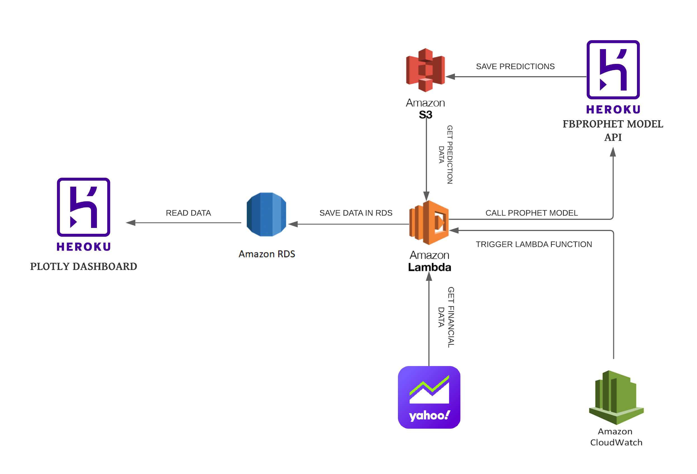
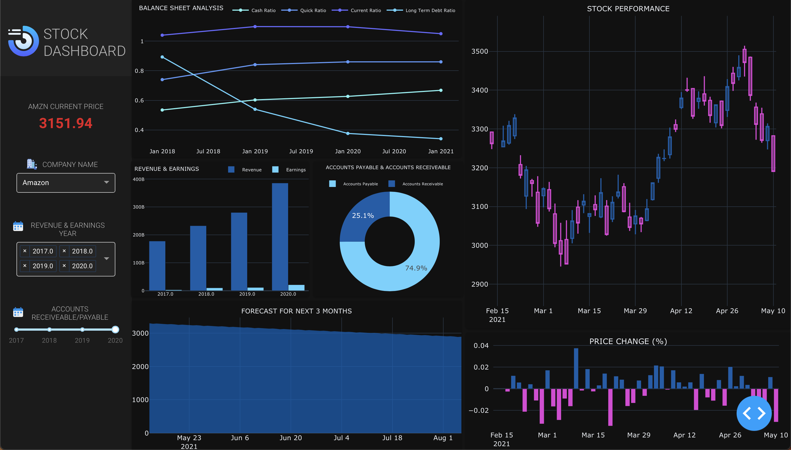

# STOCK MARKET DASHBOARD

## INTRODUCTION

The dashboard provides high level view of the company balance sheets and quarterly finances for stock traders to identify, analyze, and react to changes in the company stock prices.

## DASHBOARD ARCHITECTURE

The diagram below provides overview of the dashboard and the backend architecture.

## DASHBOARD

The dashboard can be accessed here: https://dash-stk.herokuapp.com 

## FEATURES

- Balance Sheet Analysis
- Current Stock Price
- Price Percent Change
- Forecast for Next 3 Months
- Historical Performance Data
